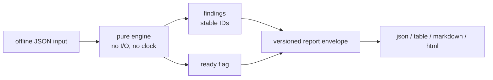

# zoho-implementation-toolkit

[](https://github.com/prashobnair/zoho-implementation-toolkit/actions/workflows/ci.yml)
[](https://github.com/prashobnair/zoho-implementation-toolkit/releases)
[](LICENSE)

An implementation engineer's safety kit for Zoho: one CLI, one report format, one safety model.

## The problem

"We're moving off Pipedrive to Zoho One next quarter, and nobody can tell us what will break: duplicate contacts, orphan deals, workflows that loop, invoices that don't match. We find out after go-live." — Marigold Labs, RevOps lead.

## What it does

- Audits a CRM migration source before import (orphans, duplicates, stage mapping).
- Diffs sandbox-vs-production manifests (removals, behavior changes, missing dependencies) with a stable fingerprint.
- Simulates workflow rules over a record (loops, duplicate follow-ups, missing owners).
- Reconciles Books invoices against CRM deals (missing, orphan, cross-entity, currency).
- Checks metric contracts over CRM/Books/People tables (joins, freshness, audience views).
- Composes client-safe timelines with contradiction review.
- Routes inbound leads to queues (consent, duplicates) without sending anything.
- Proves a rebuilt form matches the original on every supplied case.
- Emits one versioned report envelope (JSON/table/Markdown/HTML) with stable finding IDs, a readiness flag and strict exit codes; every input/output model ships a versioned JSON Schema under `schemas/`.

## Quickstart (offline, 60 seconds)

<!-- ci:run -->

```sh
uv sync
uv run zohokit version
uv run zohokit modules list
```

Then audit a fixture, for example `uv run zohokit migration audit
tests/golden/legacy/migration/inputs/03_clean.json --strict`. Every module
renders `--format json|table|markdown|html` and writes to a file with `--out`;
`--help` works on the root and on every module.

## Live mode (read-only, your own Zoho Developer Edition org)

Live reads are opt-in, `GET`-only and budget-capped (200 calls per run).
Connect once, then verify:

```sh
uv run zohokit auth login --profile dev-in --dc in --scopes ZohoCRM.modules.READ,ZohoCRM.settings.READ,ZohoCRM.users.READ,ZohoCRM.org.READ
uv run zohokit doctor --live --profile dev-in --experimental
```

A weekly `live` workflow re-runs the checklist plus smoke reads against
the Developer Edition org and uploads redacted evidence as an artifact.
Verified against a Zoho CRM Developer Edition (IN) on 2026-10-03; weekly read-only checks ([evidence](docs/evidence/2026-10-03/README.md)).
Setup (Self Client, scopes, secrets, approving a run):
[docs/live/SETUP.md](docs/live/SETUP.md).

## How it works



Eight modules (`migration`, `release`, `workflow`, `forms`, `books`,
`metrics`, `timeline`, `lead_routing`) share one core (`src/zohokit/core/`):
findings, stable identities, money/time/graph/plan utilities and exit codes.
Connectors and the CLI are thin adapters. Third-party modules register through
the `zohokit.modules` entry-point group and appear in `zohokit modules list`.

Differences from the original zoho-* tools: see docs/legacy-parity.md.

## Engineering decisions

| Decision | Why | Trade-off |
|---|---|---|
| `uv` + `src/` layout | Fast, reproducible envs; import-safe packaging | Newer tool; pinned via `uv.lock` |
| Golden parity against legacy outputs | 37 captured outputs prove the ports behave identically (except documented fixes) | Goldens freeze legacy quirks until the v2 rewrites |
| Stable finding IDs from input data, never positions | Reports stay comparable across runs and case reorderings | Discriminator design per module ([ADR-0001](docs/adr/0001-tooling-and-layout.md)) |
| Unavailable flags fail loudly | `--live` and friends exit 1 with the release that unlocks them, never silently ignored | Extra flags in `--help` before the features exist |
| COQL disabled ([ADR-0003](docs/adr/0003-coql-disabled.md)) | COQL needs POST, which conflicts with the GET-only guard | GET search endpoints only, until decided otherwise |

## Scope & safety

> This tool never writes to any Zoho org, never sends messages, never stores real personal or customer data in-repo, and reads live data only with `--live --profile` (GET-only, budget-capped). AI assistance does not exist yet and will stay opt-in, cited and never auto-applied when it lands.

## Roadmap · Contributing · License

Roadmap: [CHANGELOG.md](CHANGELOG.md) and [GitHub releases](https://github.com/prashobnair/zoho-implementation-toolkit/releases). Contributing: [CONTRIBUTING.md](CONTRIBUTING.md). License: MIT ([LICENSE](LICENSE)).
