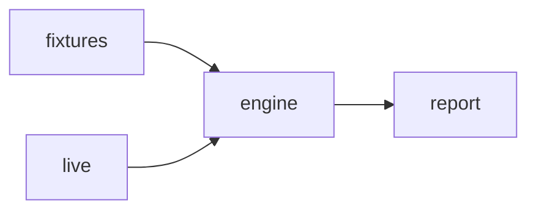

# zoho-implementation-toolkit

An implementation engineer's safety kit for Zoho: one CLI, one report format, one safety model. [badges: CI · coverage · release · license · Pages]

> Scaffold status (WP-05 dry run): legacy history imported under `legacy/`, shared-core skeleton in `src/zohokit/core/`. Module ports land in WP-08/09.

## The problem

"We're moving off Pipedrive to Zoho One next quarter, and nobody can tell us what will break: duplicate contacts, orphan deals, workflows that loop, invoices that don't match. We find out after go-live." — Marigold Labs, RevOps lead.

## What it does

- Audits a CRM migration source before import (orphans, duplicates, stage mapping).
- Gates releases with sandbox-vs-production diffs, deploy order and rollback plans.
- Lints workflow rules for loops, conflicts and stale references.
- Reconciles Books invoices against CRM deals into a sign-off workbook.
- Checks metric contracts before dashboards are built.
- Composes client-safe timelines with contradiction review.
- Backtests lead-routing policy changes on history.
- Proves form migrations equivalent with generated cases.

## Quickstart (offline, 60 seconds)

```sh
uv sync
uv run zohokit version
uv run zohokit modules list
```

## Live mode (read-only, your own Zoho Developer Edition org)

Live reads are opt-in (`--live --profile dev-in`), GET-only, and budget-capped. See `docs/live/SETUP.md` (lands WP-13).

## How it works



Pure core in `src/zohokit/core/`; connectors and CLI are thin adapters. Every run produces a versioned report envelope with stable finding IDs.

## Engineering decisions

| Decision | Why | Trade-off |
|---|---|---|
| `uv` + `src/` layout | Fast, reproducible envs; import-safe packaging | Newer tool; pinned via `uv.lock` |
| History via `git filter-repo --to-subdirectory-filter` | `git log --follow legacy/<name>/<file>` shows original commits | Commit SHAs change vs the source repos |
| COQL disabled (ADR-0003) | COQL needs POST, which conflicts with the GET-only guard | GET search endpoints only, until decided otherwise |

## Scope & safety

> This tool never writes to any Zoho org (plans only), never sends messages, never auto-applies AI suggestions, and never stores real personal or customer data in-repo. Live mode is read-only against your own Developer Edition/trial org.

## Roadmap · Contributing · License

Roadmap: `specs/02` release plan (§10). Contributing: `CONTRIBUTING.md`. License: MIT (`LICENSE`).
